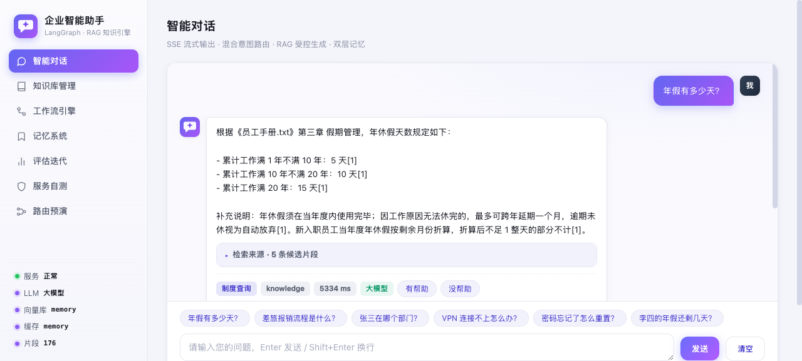
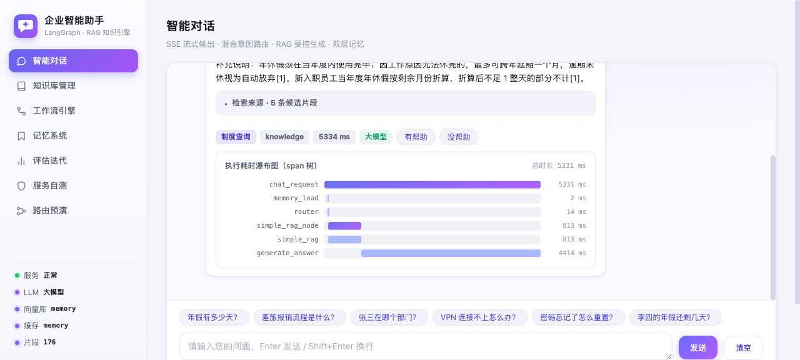
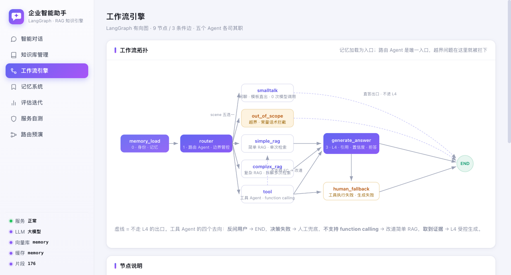
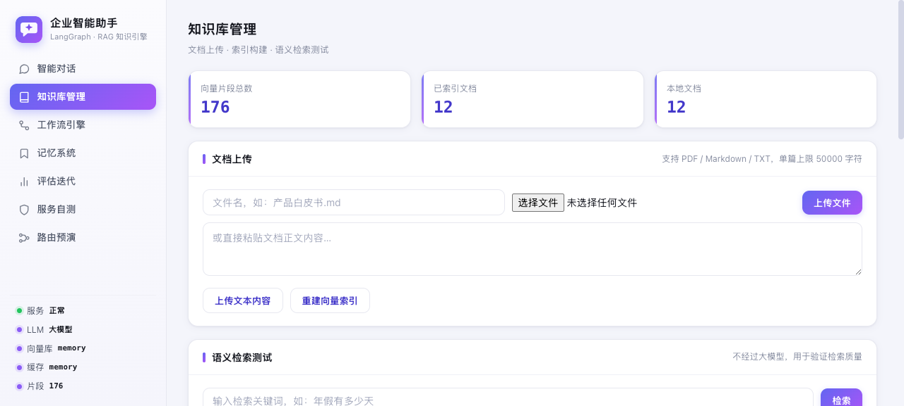

# 企业智能助手 · RAG 知识引擎

基于 **LangGraph + FastAPI + 大模型** 的企业级智能助手系统，打通私有知识库检索与企业内部业务系统，
以**五个职责单一的子 Agent**（路由 / 闲聊 / 简单 RAG / 复杂 RAG / 工具）协作完成
意图识别、边界管控、知识问答、业务工具调用、多轮对话与异常兜底的全链路闭环。

## 效果速览

<table>
  <tr>
    <td width="50%">
      <b>智能对话</b><br/>
      
    </td>
    <td width="50%">
      <b>执行耗时瀑布图</b><br/>
      
    </td>
  </tr>
  <tr>
    <td width="50%">
      <b>工作流引擎</b><br/>
      
    </td>
    <td width="50%">
      <b>知识库管理</b><br/>
      
    </td>
  </tr>
</table>

**目录**：[一、核心能力](#一核心能力) · [二、部署与启动](#二部署与启动) · [三、功能展示](#三功能展示) ·
[四、项目结构](#四项目结构) · [五、LangGraph 工作流](#五langgraph-工作流五-agent-协作) ·
[六、API 接口清单](#六api-接口清单) · [七、关键设计说明](#七关键设计说明) ·
[八、配置说明](#八配置说明) · [九、实测结果](#九实测结果) · [十、二次开发指引](#十二次开发指引)

> 更细的代码地图见 [`docs/project-introduction.md`](docs/project-introduction.md)
> （带精确行号，由 pytest 里的校验器守着）；当前架构的权威描述见
> [`docs/multi-agent-architecture.md`](docs/multi-agent-architecture.md)。

---

## 一、核心能力

| 能力 | 说明 |
|---|---|
| 多 Agent 协作 | **路由 Agent 是唯一入口**：先走**本地意图漏斗**（零模型，句式固定的提问亚毫秒判定），判不了才交给模型，在 `smalltalk` / `out_of_scope` / `simple_rag` / `complex_rag` / `tool` 五选一。职责单一带来的收益是**失败模式局部化**——闲聊挂了不影响检索，工具挂了不影响问答 |
| 入口层边界管控 | 「越界问题」只有**一份**判定逻辑（路由提示词 + 确定性兜底正则），改一处全局生效；越界在消耗检索 / 工具 / 生成预算**之前**就被拦下，回复是常量话术（只被判别、不被生成，故不可能编造事实） |
| 闲聊零成本直出 | 寒暄**不调模型、不检索、不调工具**（`app/core/sub_agents.py` 模板直出），因此闲聊不可能误触发 RAG 或 function calling 而浪费 token；离线 Mock 模型下行为也完全一致 |
| RAG 五层架构 | 数据准备 → 索引构建 → 检索优化 → 生成控制 → 评估迭代（`app/rag/`），多路召回 + RRF 融合 + 引用溯源 + 置信度拒答 |
| 混合检索增强 | 向量 + 词面**独立**倒排索引（BM25）并发召回；lost-in-the-middle 片段重排；Embedding 缓存（查询 LRU+TTL、文档内容哈希持久化） |
| Rerank 精排（可选） | cross-encoder 二次评分重排，与 reorder 正交。两种后端按配置自动选：配了 `RERANK_BASE_URL` + Key 走 `/rerank` 接口，否则回退本地 `sentence-transformers`。**默认关闭** —— 2026-09-18 实测在本项目用例集上三项指标全部下降（见 §八），开启前建议先跑 `scripts/eval_retrieval.py` 自己验一次 |
| 请求级上下文 | 同请求内共享中间结果，避免重复计算与参数穿透（`app/core/request_ctx.py`）：query 向量复用、来源白名单、本轮证据。**授权事实与证据不由模型回传**——否则等于把"我能查谁的资料"交给模型决定 |
| 可观测性 | 嵌套 span 树（对齐 OpenTelemetry 的 trace=span 树）+ 前端瀑布图 + `logs/trace.jsonl` 持久化（**落盘前统一过一层脱敏**，见 `TRACE_MASK_*`）；可选接入 LangSmith（`LANGSMITH_*` 环境变量，LangChain 自动 trace） |
| 工程化横切 | 统一异常基类、Prompt 注册表、trace_id 贯穿日志、入站限流（滑动窗口，默认 20 次/分/IP） |
| 长短期记忆 | 短期滑动窗口 → 会话归档 → LLM/规则蒸馏为长期事实（`app/memory/`），支持人工审阅修正 |
| 评估迭代 | 命中率 / MRR / 用户好评率可查询（`/evaluate/*`），反馈驱动调优闭环 |
| 业务工具集成 | **3 个只读工具**（`app/tools/sqlite_tools.py`）：按姓名查员工 / 按工号查员工信息 / 查假期余额，数据源为 SQLite（`app/db/enterprise_db.py`）。只读三层强制：连接层 `mode=ro` + 代码层只有 SELECT + 测试层真的尝试写入并断言失败 |
| 无登录态设计 | 服务端**没有登录态**：`user_id` 只用于隔离长期记忆，不参与任何鉴权，也没有工具会读它。工号只能来自用户原话或工具返回值——正常路径下由 `find_employee_by_name` 换取，模型不得编造。遇到「**我的**年假还剩几天」这类问法，正确行为是向用户索要姓名或工号 |
| 多轮对话记忆 | 会话级上下文，自动裁剪最近 10 轮，24 小时自动过期 |
| 可视化面板 | 全新设计系统（靛紫品牌色 / 侧边栏布局 / 移动端响应式）：智能对话（流式输出/引用溯源/场景徽章/反馈）/ 知识库管理 / 工作流引擎 / 记忆系统 / 评估迭代 / 服务自测六大模块 |
| 全链路自测 | 启动执行本地轻量自检（9 项，不真实调用模型），深度检查（真实调用 LLM/Embedding）经 `/test/all` 手动触发；另提供 610 项 pytest 回归（含 80 项多 Agent 架构级用例） |

---

## 二、部署与启动

### 环境要求

| 依赖 | 版本 | 是否必需 | 说明 |
|---|---|---|---|
| Python | 3.13（推荐）/ 3.10+ | ✅ | 依赖 `requirements.txt` |
| Redis | 7.x | ❌ | 会话历史持久化；不可用时自动降级为进程内字典 |
| 向量库 | chroma / milvus | ❌ | 默认 `memory`（零依赖，数据落 `vector_store/`），单实例够用 |
| 大模型 API | 任意 OpenAI 兼容服务 | ❌ | 留空则启用本地 Mock 模型，**全链路照样跑得通** |
| Embedding API | OpenAI 兼容 `/embeddings` | ❌ | 留空则降级为本地哈希向量 |

> **零配置可用性是这个项目的硬要求**：没有 Key、没有 Redis、没有向量库时，
> 服务仍应完整启动并返回合理答案（Mock 模型 + 本地哈希向量）。
> 因此"先把环境跑起来"和"接真实模型"是两件可以分开做的事。

### 方式一：本地部署（推荐先跑这个）

```bash
# 1) 进入项目目录并建虚拟环境
cd langgraph-enterprise-bot
python3 -m venv .venv
source .venv/bin/activate          # Windows: .venv\Scripts\activate

# 2) 安装依赖
pip install -r requirements.txt

# 3) 准备配置（可选：不配也能跑，会走 Mock 降级）
cp .env.example .env
#    编辑 .env，至少填 LLM_API_KEY / LLM_BASE_URL / LLM_MODEL_NAME
#    Embedding 默认复用 LLM 的 Key 与地址，也可单独指定 EMBEDDING_*

# 4) 启动服务
python -m uvicorn app.main:app --host 0.0.0.0 --port 8001

# 5) 打开可视化面板
open http://localhost:8001         # 或浏览器访问 http://localhost:8001
```

**验证部署是否成功**：

```bash
curl -s http://localhost:8001/health                 # 健康检查（Docker 健康检查也是打这个）
curl -s http://localhost:8001/test/self-check        # 启动自检 9 项的详情
curl -s http://localhost:8001/knowledge/stats        # 知识库片段数（首次启动会自动建索引）
```

首次启动会自动完成两件事：**本地轻量自检**（探活基础设施，不真实调用 LLM，
避免启动被上游网络拖住）、**知识库为空时自动建索引**。所以放进 `data/` 的文档
无需手工触发重建；改了文档再调 `POST /knowledge/rebuild`。

业务数据库（SQLite，供 3 个只读工具查询）首次部署需播种一次：

```bash
python scripts/seed_enterprise_db.py
```

### 方式二：Docker Compose 一键部署

```bash
docker compose up -d          # 启动应用 + Redis
docker compose logs -f app    # 查看日志
docker compose down           # 停止
```

默认编排只含 **应用 + Redis**。要用 **Milvus** 向量库时，用 profile 按需拉起
Milvus Standalone——它会一并启动所依赖的 **etcd** 与 **minio**，共三个容器
（Milvus 自己不存元数据与对象，单起一个 milvus 容器是起不来的）：

```bash
# 1) 构建镜像时必须把向量库客户端装进去，否则容器内缺包会降级为内存库
#    （WITH_VECTOR_CLIENTS=1 让镜像多装 chromadb + pymilvus，约 +120MB）
# 2) 首次启动约需 60~90s 等三容器健康
WITH_VECTOR_CLIENTS=1 VECTOR_DB_TYPE=milvus docker compose --profile milvus up -d --build

# 验证容器真的连上了（而不是悄悄退回内存库）
docker compose exec app python scripts/check_vector_db.py
```

（把 `WITH_VECTOR_CLIENTS=1`、`VECTOR_DB_TYPE=milvus` 写进 `.env` 后，即可省略前缀，
只 `docker compose --profile milvus up -d --build`。）

> **建议同时设 `VECTOR_DB_STRICT=true`**：否则一旦客户端包没装、或 Milvus 没起来，
> 服务会照常启动但把数据写进容器内的内存库——看起来一切正常，实际检索的是空索引。
> 打开严格模式后这类问题会直接拒绝启动，并在日志里说明原因。

### 生产部署清单

从"能跑"到"能上线"，下面几项需要显式确认（默认配置是为了**本地零依赖可跑**，
不是为生产准备的）：

| 项 | 默认 | 生产建议 | 不做会怎样 |
|---|---|---|---|
| `VECTOR_DB_TYPE` | `memory` | `chroma`（单机）或 `milvus`（分布式） | 进程重启即丢索引，且无法多实例共享 |
| `VECTOR_DB_STRICT` | `false` | `true` | 配了生产后端却连不上时**静默**退回内存库：服务照常 200，实际检索的是空索引 |
| `LLM_API_KEY` | 空 | 必填 | 走 Mock 规则模型，回答质量不可用于生产 |
| `WITH_VECTOR_CLIENTS` | `0` | 用 chroma/milvus 时设为 `1` | 容器内缺 `chromadb` / `pymilvus`，同样静默退回内存库 |
| `REDIS_HOST` | 空 | 指向 Redis | 会话历史降级为进程内字典，重启即丢、多实例间不共享 |
| `TRACE_MASK_ENABLED` | `true` | 保持 `true` | trace 原文（可能含提问正文）落盘 |
| `RATE_LIMIT_PER_MINUTE` | 20 | 按业务调整 | 单 IP 限流，多副本时会被放大 N 倍（见下节） |
| 反向代理 | 无 | Nginx / Caddy 反代 8001 | SSE 流式响应须关掉代理缓冲，否则前端拿不到逐字输出 |

Nginx 反代 SSE 的关键两行（缺一就变成"等全部生成完才一次性返回"）：

```nginx
proxy_buffering off;          # 不缓冲，否则流式被攒成一次性响应
proxy_read_timeout 300s;      # 长连接别被默认 60s 掐断
```

### 常见排障

| 现象 | 优先查 |
|---|---|
| 服务起来了但检索全是空 | `VECTOR_DB_TYPE` 实际生效的是哪个：`docker compose exec app python scripts/check_vector_db.py` |
| 面板显示 `Mock 模型` | `.env` 里 `LLM_API_KEY` 是否为空；容器内是否真的注入了环境变量 |
| 流式输出不逐字、一次性返回 | 反向代理的 `proxy_buffering`（见上） |
| 启动卡住、端口迟迟不 LISTEN | `LLM_HEALTH_CHECK=true` 会在启动时真实 ping 模型，上游不通/限流会拖住启动 |
| 检索质量突然变差 | 先跑 `python scripts/eval_retrieval.py` 对比基线，再怀疑代码 |
| 「某条知识怎么问都检索不到」 | 先跑一次索引对账（向量库与词面索引的来源集合是否一致）：`python -c "from app.rag.indexer import reconcile; print(reconcile())"` |

### ⚠️ 部署形态：默认单实例

**本服务不是无状态服务。** 有五处状态是模块级单例或进程内字典：

| 状态 | 位置 | 无外部依赖时的形态 |
|---|---|---|
| 会话历史 | `app/memory/chat_history.py` | Redis 不可用时降级为 `MemoryRedis`（进程内字典） |
| 内存向量库 | `app/db/vector_db.py` | `VECTOR_DB_TYPE=memory` 时是进程内 numpy 数组 |
| 词面倒排索引 | `app/rag/lexical.py` | 进程内索引对象 + 本地 json 落盘 |
| Embedding 缓存 | `app/utils/cache.py` | 查询 LRU + 文档哈希，进程内 |
| 入站限流计数 | `app/core/rate_limit.py` | 进程内滑动窗口 |

因此：

- ✅ **单进程 / 单容器**（uvicorn 默认单 worker）
- ❌ `uvicorn --workers N`、compose 里 `deploy.replicas > 1`、K8s 多副本

多副本下**不会报错**，只会静默出错：会话粘性失效（同一个会话被分到不同副本，
历史时有时无）、限流形同虚设（每个副本各算一份计数，实际放行量 ×N）、
上游 LLM 调用量被放大。服务照常返回 200，行为却不正确——这比崩溃更难排查。

要突破这个限制，需要先把上述状态外置到 Redis（项目已经把 Redis 用在缓存上，
但**没有**用在会话状态上）。详见 [`docs/deployment.md`](docs/deployment.md) 第一节。

### 运行测试

```bash
# 主回归套件（610 项，纯 pytest，不需要起服务）
pytest                                   # 全量
pytest tests/test_multi_agent.py -q      # 只跑多 Agent 架构级用例（80 项）
pytest -k tool_agent                     # 按名字筛选

# 端到端脚本（需先起服务；4 阶段 9 项，走真实 HTTP）
python tests/test_service.py                        # 全量
python tests/test_service.py --url http://host:8001 # 指定服务地址
python tests/test_service.py --skip-heavy           # 跳过耗时项
python tests/test_service.py -v                     # 详细日志
```

### 本地门禁（改完代码必跑两条）

```bash
pytest                                                             # 含文档行号校验、分层契约、死代码扫描
ruff check app scripts tests --no-cache --output-format concise    # 静态检查
```

文档行号漂移时，回填脚本会自动改写 `docs/project-introduction.md`：

```bash
python scripts/fix_doc_linenos.py            # dry-run，只看会改什么
python scripts/fix_doc_linenos.py --write    # 落盘（自动备份到 artifacts/backup/）
```

### 检索质量评测（改动检索链路前后各跑一次）

```bash
python scripts/eval_retrieval.py             # 输出四项指标 + 最差 N 条，并与基线 diff
python scripts/eval_retrieval.py --worst 10  # 多看几条最差样本
python scripts/eval_retrieval.py --update    # 确认后刷新基线（默认拒绝覆盖）
```

输出 `hit_rate / MRR / Recall@K / NDCG@K` 与**按 NDCG 升序的最差样本**——
看一个平均分远不如看最差的几条。⚠️ 会真实调用 embedding 接口（每条用例一次）。

同目录还有 `scripts/eval_generation.py`（生成侧：拒答率 / 截断率 / 忠实度），
以及 `scripts/baseline_snapshot.py`（切分基线快照，被回归测试读取）。

> ⚠️ **不要把 `pytest` 放到后台任务里跑。** 沙箱会拦截 `tmp_path` 的目录创建
> （报 `PermissionError` 而非 `FileExistsError`，绕过 pytest 自身的容错），
> 导致所有用到 `tmp_path` 的用例**批量 ERROR**，看起来像代码崩了。
> `pytest.ini` 里固定 `--basetemp=.pytest_tmp` 就是为了规避这一点，
> 但后台任务的沙箱限制更严，仍会命中。前台跑即可。

---

## 三、功能展示

前端是**零构建的单文件 SPA**（`app/static/index.html`，服务起在 8001 端口即可直接访问），
六大模块对应后端的六组能力。

### 3.1 智能对话

流式输出、**引用溯源**（正文里的 `[1]` 可跳转回原文片段）、场景徽章
（路由判定的意图 / 命中的知识域 / 耗时）、以及点赞点踩反馈。

<p align="center"></p>

### 3.2 可观测性：执行耗时瀑布图

每次请求产出一棵**嵌套 span 树**（对齐 OpenTelemetry 的 trace=span 树），
面板按耗时比例画出瀑布图，能直接看出"这一轮到底慢在哪一步"。

<p align="center"></p>

### 3.3 工作流引擎

LangGraph 拓扑可视化：**9 个节点 / 3 条条件边**，路由 Agent 是唯一入口。
面板会展示当前编译图的节点集合，改了图却忘了同步节点标签会在这里露出来。

<p align="center"></p>

### 3.4 知识库管理

文档上传（PDF / Markdown / TXT）、索引重建、片段数与来源分布一览。
PDF 走三级降级解析，**上传路径与重建路径共用同一个入口**，不会出现"同一个 PDF
两种解析结果"。

<p align="center"></p>

### 3.5 其余模块

| 模块 | 做什么 |
|---|---|
| 记忆系统 | 查看 / 写入长期事实（`MEMORY.md` / `USER.md`）、浏览会话归档、手动触发蒸馏（Dream） |
| 评估迭代 | 跑内置离线评测（命中率 / MRR）、查看好评率与最近差评、生成调优建议 |
| 服务自测 | 一键跑 9 项启动自检 + 深度检查（真实调用 LLM / Embedding） |
| 路由预演 | 输入一句话看意图漏斗各层打分与最终路由，用于排查"为什么被分到这条路" |

---

## 四、项目结构

```
langgraph-enterprise-bot/
├── app/
│   ├── main.py                 # FastAPI 入口：生命周期、路由注册、启动自检
│   ├── config.py               # 全局配置中心（全部支持环境变量覆盖，**不依赖任何业务层**）
│   ├── runtime_flags.py        # 零依赖运行时标志位：provider → config 的单向事实通道（解环用）
│   ├── api/                    # 接口路由层
│   │   ├── chat.py             #   智能对话接口（含反馈上报）
│   │   ├── knowledge.py        #   知识库管理接口
│   │   ├── memory.py           #   记忆系统管理接口（查看/写入/蒸馏）
│   │   ├── evaluation.py       #   评估迭代接口（评测/报告/建议）
│   │   ├── workflow.py         #   工作流管理接口
│   │   └── test.py             #   服务自测接口
│   ├── rag/                    # RAG 五层架构（数据准备→索引构建→检索优化→生成控制→评估迭代）
│   │   ├── prepare.py          #   L1 数据准备：清洗、元数据规范、指纹去重
│   │   ├── indexer.py          #   L2 索引构建：切片、嵌入、增量入库（chunk_id 内容哈希）
│   │   ├── lexical.py          #   L3 词面倒排索引：BM25 增量索引 + json 落盘
│   │   ├── retriever.py        #   L3 检索优化：向量+词面三路并发召回、RRF 融合
│   │   ├── reorder.py          #   L3 片段重排：lost-in-the-middle 缓解
│   │   ├── generator.py        #   L4 生成控制：引用溯源、置信度拒答、长忆注入
│   │   ├── evaluator.py        #   L5 评估迭代：命中率/MRR/好评率、调优建议
│   │   └── eval_cases.yaml     #   L5 评测用例（外置，无需改码即可增删）
│   ├── memory/                 # 记忆系统（短期窗口 / 归档 / 蒸馏两阶段）
│   │   ├── store.py            #   文件存储层：history.jsonl / MEMORY.md / USER.md
│   │   ├── short_term.py       #   短期记忆：滑动窗口 + 字符预算裁剪
│   │   ├── long_term.py        #   长期记忆：事实去重沉淀、规则化抽取降级
│   │   ├── consolidator.py     #   整理器：会话超阈值压缩归档
│   │   └── dream.py            #   蒸馏器：归档→长期知识（LLM/规则双通道）
│   ├── core/                   # 核心能力引擎
│   │   ├── router_agent.py     #   路由 Agent：入口判定 + 边界管控（越界话术常量在此）
│   │   ├── sub_agents.py       #   闲聊 / 简单 RAG / 复杂 RAG 三个子 Agent
│   │   ├── tool_agent.py       #   工具 Agent：参数抽取、缺失追问、链式调用
│   │   ├── rag_engine.py       #   RAG 兼容门面（转发到 app/rag/ 五层）
│   │   ├── llm_factory.py      #   大模型工厂（真实 / Mock 双模式，原生 function calling）
│   │   ├── self_check.py       #   启动自检（9 项）
│   │   ├── request_ctx.py      #   请求级上下文（query 向量 / 来源白名单 / 本轮证据）
│   │   ├── source_acl.py       #   来源白名单：按部门做知识隔离
│   │   ├── errors.py           #   统一异常基类（ragas 范式：单基类 + 内置文案）
│   │   ├── prompts.py          #   Prompt 注册表（散落提示词收敛 + 变量校验）
│   │   ├── tracing.py          #   trace_id 贯穿 + span 计时（contextvars）
│   │   ├── observability.py    #   观测输出（trace.jsonl / LangSmith）
│   │   └── rate_limit.py       #   入站限流（内存滑动窗口，按 IP）
│   ├── db/                     # 数据层封装
│   │   ├── vector_db.py        #   向量库（memory / chroma / milvus 三后端）
│   │   ├── enterprise_db.py    #   SQLite 业务数据（只读连接 + 4 个查询函数）
│   │   └── redis_db.py         #   Redis 连接池（自动降级内存）
│   ├── graph/                  # LangGraph 工作流
│   │   ├── state.py            #   全局状态定义（scene 与 intent_type 的分工见模块 docstring）
│   │   ├── nodes.py            #   9 个节点（含五个 Agent）
│   │   ├── edges.py            #   3 条条件边（场景分发 + 工具改道 + 生成出口）
│   │   └── workflow_graph.py   #   图组装编译（完整图 + 流式前置图共用一套装配函数）
│   ├── tools/                  # 业务工具（全部只读）
│   │   └── sqlite_tools.py     #   4 个 Function Calling 工具（含 JSON Schema 定义）
│   ├── utils/                  # 通用工具（依赖树的**最底层**，不得反向依赖上层）
│   │   ├── logger.py           #   全链路日志（含 trace_id 注入）
│   │   ├── doc_loader.py       #   多格式文档解析（PDF 三级降级）
│   │   ├── cache.py            #   Embedding 缓存（查询 LRU+TTL、文档哈希持久化）
│   │   └── validator.py        #   安全参数校验
│   ├── providers/              # 外部能力适配层（统一降级入口，换模型只改配置）
│   │   ├── llm.py              #   LLM：OpenAI 兼容 API / MockChatModel
│   │   ├── embeddings.py       #   Embedding：API / 本地哈希向量（双模式降级）
│   │   └── rerank.py           #   精排：APIReranker（/rerank 接口）/ 本地 cross-encoder
│   └── static/index.html       # 前端 SPA 可视化面板
├── data/                       # 企业知识库原始文档 + enterprise.db（SQLite 业务数据）
├── tests/                      # pytest 回归套件（610 项）
│   ├── test_multi_agent.py     #   多 Agent 架构级用例（80 项，守"谁来做决定"）
│   ├── test_sqlite_tools.py    #   3 个只读工具 + 只读强制 + 边界情形
│   ├── test_layering.py        #   分层契约（import-linter，含"契约真的会红"自检）
│   ├── test_doc_linenos.py     #   文档行号校验器自身的回归（十四类逐类反向验证）
│   └── test_service.py         #   端到端脚本（4 阶段 9 项，需起服务）
├── docs/                       # 设计文档与事故复盘（multi-agent-architecture.md 为当前架构权威）
├── scripts/                    # 运维与门禁脚本
│   ├── eval_retrieval.py       #   检索评测：hit_rate / MRR / Recall / NDCG + 最差 N 条
│   ├── eval_generation.py      #   生成评测：拒答率 / 截断率 / 忠实度
│   ├── verify_doc_linenos.py   #   文档行号门禁（已纳入 pytest）
│   ├── fix_doc_linenos.py      #   行号自动回填（--write 生效，自动备份）
│   ├── deadcode_scan.py        #   死代码扫描（由 tests/test_deadcode.py 驱动）
│   └── seed_enterprise_db.py   #   业务库播种
├── _archive/                   # 已删除实现的历史存档（含 README 说明删除理由）
├── vector_store/               # 向量索引持久化目录
├── logs/                       # 运行日志（含 trace.jsonl）
├── docker-compose.yml          # 容器编排
├── Dockerfile                  # 镜像构建
├── requirements.txt            # 依赖清单
└── .env.example                # 配置模板
```

---

## 五、LangGraph 工作流（五 Agent 协作）

**九个节点，三条条件边。** 路由 Agent 是唯一入口，五个子 Agent 各自只做一件事。

```
                        ┌───────────────┐
                        │  memory_load  │  ⓪ 请求初始化（身份解析 + 记忆加载）
                        └───────┬───────┘
                                ▼
                        ┌───────────────┐
                        │    router     │  ① 路由 Agent：本地漏斗优先，判不了才调模型
                        │  唯一入口     │     边界管控集中在此，「越界」就地拦下
                        └───────┬───────┘
              条件分支 ①（五路互斥）│
     ┌──────────┬──────────┬───────┴────┬──────────┬──────────┐
     ▼          ▼          ▼            ▼          ▼
┌─────────┐┌─────────┐┌──────────┐┌───────────┐┌─────────┐
│smalltalk││out_of_  ││simple_rag││complex_rag││  tool   │
│ 闲聊    ││scope    ││ 简单 RAG ││  复杂 RAG ││ 工具    │
│模板直出 ││越界拦截 ││ 单次检索 ││ 拆解+多检索││FC 调用  │
└────┬────┘└────┬────┘└────┬─────┘└─────┬─────┘└────┬────┘
     │          │          │            │           │
     │      常量话术        └─────┬──────┘     条件分支 ②（四路）
     │          │               ▼            ┌────┴────┬──────────┬─────────┐
     │          │       ┌───────────────┐    ▼         ▼          ▼         ▼
     │          │       │generate_answer│ 反问用户  决策失败   不支持FC  有证据
     │          │       │ ④ 受控生成    │  → END   → 人工兜底 →simple_rag →生成
     │          │       │ 引用+拒答+流式│
     │          │       └───────┬───────┘
     │          │       条件分支 ③│
     │          │      ┌────────┴────────┐
     │          │      ▼                 ▼
     │          │┌───────────────┐
     │          ││human_fallback │  ⑤ 人工兜底（阻断幻觉）
     │          │└───────┬───────┘
     └──────────┴────────┴──────────────►【END】
```

| Agent | 输入 | 输出 | 模型调用 |
|---|---|---|---|
| **路由** | 用户原话 | `scene` + 判定理由 + 来源 | 1 次（异常回落确定性规则） |
| **闲聊** | 用户原话 | 模板回复 | **0 次** |
| **简单 RAG** | 用户原话 | 证据片段 + 答案 | 检索 1 次 |
| **复杂 RAG** | 用户原话 | 拆解后的多个子问题 + 合并证据 | 1 次（拆解）+ 多次检索 |
| **工具** | 用户原话 + 历史 | 工具结果 / 追问话术 | 1~N 次（链式调用） |

**两个编译产物共用同一个装配函数**（`build_workflow_graph` 9 节点 / `build_pre_generation_graph` 8 节点），
唯一差别是"证据出口通向 `generate_answer` 还是 `END`"——流式链路**不可能**重抄一遍业务逻辑。

**降级决策落在「边」上而不是「节点」里**：`tool_node` 只负责写 `tool_degraded=True`，
改道哪个分支由 `tool_route_edge` 决定。拓扑完整地留在拓扑里，才看得见、测得着。

**对话后置**：会话归档（consolidator）→ 低峰蒸馏（dream）沉淀长期记忆

> 详细设计（为什么拆、`scene` 与 `intent_type` 的分工、失败处置的统一判据、重构方案）
> 见 [`docs/multi-agent-architecture.md`](docs/multi-agent-architecture.md)；
> 4 个工具的完整实现与 Function Calling JSON Schema 见 [`docs/tool-json-schema.md`](docs/tool-json-schema.md)。

---

## 六、API 接口清单

### 对话服务
| 方法 | 路径 | 说明 |
|---|---|---|
| POST | `/chat/ask` | 核心智能对话接口，支持多轮问答（响应含 `scene` 场景判定、`intent` 实际出口与 `route_decision` 决策明细） |
| POST | `/chat/ask/stream` | **SSE 流式对话**：`stage`（路由/检索进度）→ `token`（逐字输出）→ `meta`（来源/引用/耗时）→ `done` |
| GET | `/chat/history/{session_id}` | 查询会话历史 |
| DELETE | `/chat/history/{session_id}` | 清空会话历史 |
| GET | `/health` | 服务健康状态 |

> 场景字段（`scene`）与出口字段（`intent`）的区别：前者回答"这件事该由谁干"，
> 后者回答"答案是怎么来的"。工具 Agent 反问用户时 `scene=tool` 而 `intent=direct`——
> 合并成一个字段就会得到"路由要预判执行结果"的悖论。

### 知识库管理
| 方法 | 路径 | 说明 |
|---|---|---|
| GET | `/knowledge/list` | 文档列表与索引统计 |
| POST | `/knowledge/upload` | 上传文本形式文档 |
| POST | `/knowledge/upload-file` | 上传 PDF / MD / TXT 文件 |
| DELETE | `/knowledge/{file_name}` | 删除指定文档 |
| POST | `/knowledge/search` | 纯语义检索测试 |
| POST | `/knowledge/rebuild` | 重建向量索引 |

### 工作流与自测
| 方法 | 路径 | 说明 |
|---|---|---|
| GET | `/workflow/status` | 工作流状态与拓扑 |
| POST | `/workflow/execute` | 手动触发工作流执行 |
| GET | `/test/all` | 全量服务测试（含深度检查：真实调用 LLM / Embedding） |
| GET | `/test/quick` | 3 项快速健康检测 |
| GET | `/test/health` | 轻量健康检查 |

### 记忆系统
| 方法 | 路径 | 说明 |
|---|---|---|
| GET | `/memory/{user_id}` | 查看全部长期记忆（人工审阅与修正） |
| GET | `/memory/{user_id}/stats` | 记忆状态：归档条数、待蒸馏量、开关 |
| POST | `/memory/{user_id}/facts` | 手动写入长期事实（自动去重） |
| POST | `/memory/{user_id}/dream` | 手动触发记忆蒸馏（归档→长期知识） |
| DELETE | `/memory/{user_id}` | 清空长期事实与用户画像 |

### 评估迭代（RAG L5）
| 方法 | 路径 | 说明 |
|---|---|---|
| POST | `/evaluate/retrieval` | 检索评测：命中率 / MRR（支持自定义用例） |
| GET | `/evaluate/report` | 综合评估报告（检索 + 用户反馈） |
| GET | `/evaluate/suggestions` | 基于指标数据的调优建议 |
| GET | `/evaluate/feedback` | 用户反馈明细 |
| POST | `/chat/feedback` | 提交好评/差评，喂给评估闭环 |

交互式文档：`http://localhost:8001/docs`

---

## 七、关键设计说明

### 1. 三级自动降级（保证任何环境都能跑通）

**任何外部依赖缺失都不会导致服务不可用** —— 这是一条硬要求，不是"尽量"：

| 组件 | 优先方案 | 降级方案 | 触发条件 |
|---|---|---|---|
| 大模型 | OpenAI 兼容 API | 本地规则引擎（MockChatModel） | 未配置 Key 或接口不可达 |
| Embedding | API `/embeddings` 接口 | 本地哈希向量（TF-IDF 加权） | 未配置 Key 或接口不可达 |
| 向量库 | Milvus / Chroma | 内存库（numpy + 本地持久化） | 对应后端未安装或服务不可达；设 `VECTOR_DB_STRICT=true` 可改为拒绝启动 |
| 会话缓存 | Redis | 进程内内存缓存（带 TTL） | Redis 未启动 |

降级过程会在启动日志中明确打印；向量库这一路更进一步——前端徽章会把降级标成橙色并注明
「已降级（配置 xxx）」，自测页的环境行与配置卡片同样标出，`/health` 里
`vector_db_requested` 与 `vector_db` 不一致即说明发生了降级。

### 2. 本地哈希向量的 IDF 加权

无 Key 时的降级向量方案采用 hashing trick。实测发现**不做 IDF 加权会导致段落级检索失准** ——
"的 / 员工 / 系统" 等高频词会淹没 "年假 / VPN / 报销" 这类真正有区分度的关键词，
例如查询 "VPN 连接不上" 会命中 "密码重置" 段落。

本项目在建索引时基于全语料统计 IDF 并持久化，查询时复用同一套权重。
加入 IDF 后，8 项检索用例的 Top1 命中率从段落错位提升到 **8/8**。

### 3. 检索阈值按 embedding 模式自适应

不同 embedding 的分数分布差异极大：神经向量余弦相似度通常落在 0.3~0.9，
而本地哈希向量因查询短、文档长，天然分布在 0.05~0.25。
若统一使用 0.30 阈值，会导致降级模式下**每次检索都触发软回退**，检索退化为无序返回。

因此默认阈值按模式自适应：API 模式 0.30，本地哈希模式 0.08（可用 `SCORE_THRESHOLD` 覆盖）。

### 4. RAG 软回退与同源去重

- **软回退**：阈值过滤后无结果时，自动回退到原始 Top-3 并标记 `fallback`，杜绝空应答
- **同源去重**：同一文档仅保留得分最高的片段，避免重复信息干扰生成
- **全链路可观测**：日志逐条打印候选片段的匹配分数与来源，便于阈值调优

### 5. 安全设计

- 输入注入过滤：清除 `<script>` `{{ }}` `<% %>` `javascript:` 等片段
- 参数长度限制：提问 ≤ 2000 字符，单篇文档 ≤ 50000 字符
- 文件名安全清洗：替换非法字符，禁止隐藏文件入库
- 会话 24 小时自动过期，密钥在日志与接口中脱敏展示

---

## 八、配置说明

全部配置项见 `.env.example`，核心参数：

> **已移除**：`LLM_MAX_RETRIES` / `LLM_RETRY_BASE_DELAY` / `LLM_RETRY_MAX_DELAY`。
> 它们服务的自造限流重试包装器 `_RateLimitRetryModel` 已随「改用不限流模型」
> 一并删除——那层壳曾把底层本已支持的 function calling 整个挡住。
> 现在模型直连 `ChatOpenAI`，重试由 `_build_raw_model` 的 `max_retries=0`
> 显式关闭（快速失败、交给上层降级）。

| 配置项 | 默认值 | 说明 |
|---|---|---|
| `LLM_API_KEY` | 空 | 大模型密钥，留空则启用 Mock 模型 |
| `LLM_BASE_URL` | OpenAI 官方 | 任意 OpenAI 兼容服务地址 |
| `LLM_TEMPERATURE` | 0.1 | 低温度约束，保证回答严谨。**必须与 `LLM_DISABLE_THINKING` 配套**：部分模型关思考后只接受特定温度，配错会被接口以 400 明确拒绝（见 `app/config.py` 对应注释） |
| `LLM_TIMEOUT` | 60 | 单次 LLM 请求超时（秒），过长会让慢请求迟迟不失败 |
| `LLM_HEALTH_CHECK` | false | 启动时是否对真实模型做 ping 校验。默认关是**可用性优先**——启动时上游不通不该让服务起不来；打开则能提前发现 Key / 模型名错误 |
| `EMBEDDING_API_KEY` / `EMBEDDING_BASE_URL` | 复用 `LLM_*` | Embedding 服务（OpenAI 兼容 `/embeddings`）；留空则降级为本地哈希向量 |
| `EMBEDDING_MODEL_NAME` | text-embedding-3-small | Embedding 模型名 |
| `EMBEDDING_QUERY_PREFIX` | 空 | 查询侧指令前缀（bge 系列需要；换非 bge 模型清空即可，代码不识别模型名） |
| `VECTOR_DB_TYPE` | memory | `memory` 零依赖 / `chroma` 单机嵌入式 / `milvus` 分布式；**写错直接报错**，不会静默退回内存库 |
| `VECTOR_DB_STRICT` | false | 配了 chroma/milvus 却连不上时，`false` 降级为内存库并告警，`true` 拒绝启动 |
| `MILVUS_URI` | http://localhost:19530 | Milvus 连接地址（`VECTOR_DB_TYPE=milvus` 时生效） |
| `SIMILARITY_TOP_K` | 5 | 单次检索返回片段数 |
| `SCORE_THRESHOLD` | 自适应 | 余弦相似度阈值，留空按模式自动选择 |
| `CHUNK_SIZE` | 300 | 切片字符数 |
| `CHUNK_OVERLAP` | 60 | 切片重叠字符数 |
| `MAX_CHAT_HISTORY` | 10 | 单会话保留轮数 |
| `SESSION_TTL` | 86400 | 会话过期时间（秒） |
| `LEXICAL_BM25_K1` | 1.5 | 词面 BM25 词频饱和参数 |
| `LEXICAL_BM25_B` | 0.75 | 词面 BM25 长度归一化参数 |
| `EMBEDDING_CACHE_QUERY_TTL` | 600 | 查询向量缓存 TTL（秒） |
| `EMBEDDING_CACHE_QUERY_MAX_SIZE` | 1000 | 查询向量缓存容量 |
| `RATE_LIMIT_PER_MINUTE` | 20 | 单 IP 每分钟入站请求上限 |
| `RERANK_ENABLED` | false | 是否启用精排。**默认关闭且有实测依据**：2026-09-18 在本项目用例集上三项指标全部下降（见 §八） |
| `RERANK_MODEL` | BAAI/bge-reranker-v2-m3 | 重排模型名（不识别具体模型，换模型改这里即可） |
| `RERANK_BASE_URL` / `RERANK_API_KEY` | 复用 `EMBEDDING_*` | 精排服务地址与密钥；**两者都有值**才走 `/rerank` 接口，否则回退本地 `sentence-transformers` |
| `RERANK_CANDIDATES` | 64 | 参与精排的候选条数。实际值会**抬升到不小于 `SIMILARITY_TOP_K`**——窗口小于返回条数时，未精排的片段会混进结果 |
| `DOCSTORE_STRATEGY` | upserts_and_delete | 重建索引的对账策略：`upserts` / `duplicates_only` / `upserts_and_delete`。只有最后一种会删除语料里已消失的来源；写错会降级为默认**并告警** |
| `LANGSMITH_ENABLED` | false | 是否启用 LangSmith 可观测（需 `langsmith`） |
| `LANGSMITH_API_KEY` | 空 | LangSmith 平台密钥 |
| `LANGSMITH_PROJECT` | langgraph-enterprise-bot | LangSmith 项目名 |
| `LANGSMITH_ENDPOINT` | 空 | 自托管 LangSmith 地址，留空走官方 SaaS |
| `TRACE_MASK_ENABLED` | true | `logs/trace.jsonl` 落盘前的脱敏总开关。关掉会打一条 WARNING（那是「原样落盘」的运行姿态） |
| `TRACE_MASK_MAX_CHARS` | 64 | 单值原文保留上限，超出截为「前 N 字…<共 M 字>」；**设 0 = 只留长度、彻底不留正文** |

---

## 九、实测结果

环境：Python 3.13.12 / macOS，API 模式（真实 Embedding + 真实大模型）

```
启动自检：9/9 通过
  服务健康状态 / 知识库资源 / 大模型配置 / 向量库与索引 / Agent 工具与路由配置
  业务数据库与工具 Schema / 语义检索能力 / LangGraph 工作流 / 端到端对话链路

全链路测试：15/15 通过
  阶段 1 服务健康 3/3 · 阶段 2 知识库 5/5
  阶段 3 工作流 2/2 · 阶段 4 对话链路 5/5

检索质量：8/8 Top1 命中预期主题
知识库：12 篇文档 → 176 条向量片段（词面倒排索引 176 个键，两处来源集合一致）

回归套件：610 passed
```

### 检索基线（`scripts/eval_retrieval.py`，27 条用例 / Top-K=5）

| 指标 | 基线 | 开 Rerank 后 | 变化 |
|---|---|---|---|
| hit_rate | 1.000 | 1.000 | ＝ |
| MRR | 0.944 | 0.926 | ↓ -0.018 |
| Recall@K | 0.715 | 0.687 | ↓ -0.028 |
| NDCG@K | 0.778 | 0.741 | ↓ -0.037 |

两个值得记住的结论：

1. **命中率在这个用例集上是天花板**（恒为 1.000）——它回答不了"排序变好了没有"。
   做检索侧 A/B 必须看 Recall / NDCG。
2. **Rerank 在本项目目前是负收益，所以默认关闭**。原因是现行相关性判据是关键词命中，
   而词面路（BM25）已经在优化这个目标；cross-encoder 优化的是语义相关，
   会把"含关键词但语义次要"的片段往下压。
   这不是"rerank 没用"，而是**当前判据测不出它的用处** —— 换判据前不要据此否定它。

---

## 十、二次开发指引

### 代码从哪读起

按"一次提问走过的路径"读，比按目录字母序读快得多：

| 顺序 | 文件 | 看什么 |
|---|---|---|
| 1 | `app/main.py` | 服务是怎么装配起来的（lifespan、中间件、路由注册、启动自检） |
| 2 | `app/core/router_agent.py` | **唯一入口**：请求先过这里决定走哪条路（本地意图漏斗优先，判不了才调模型） |
| 3 | `app/graph/nodes.py` + `edges.py` | 9 个节点 + 3 条条件边，五 Agent 协作的骨架 |
| 4 | `app/rag/retriever.py` | 检索主链路：向量 + 词面双路召回 → RRF 融合 → 阈值 → 去重 |
| 5 | `app/rag/generator.py` | 生成控制：引用溯源、置信度拒答 |
| 6 | `app/config.py` | 所有可调参数的唯一定义处（每个分区都有中文注释说明为什么这么定） |

改代码时**有三条被机制守住的规则**，违反会在 `pytest` 里直接红：

1. **分层方向**：`api → graph → core → {rag, memory, tools} → {db, providers} → utils`。
   下层不得 import 上层（契约在 `pyproject.toml` 的 `[tool.importlinter]`，
   豁免清单**只减不增**）。例外：允许能力层用 `app/core/` 里的**基础设施**
   子模块（prompts / llm_factory / tracing …）。
2. **`app/config.py` 不许依赖业务层**：它必须是依赖树的叶子。需要"运行时才知道的值"
   （如实际生效的 embedding 模式）时，由 provider 写进 `app/runtime_flags.py`，
   config 只读它——`app/runtime_flags.py` 本身**零依赖**（有契约守着）。
3. **文档里的行号必须与代码一致**：`docs/project-introduction.md` 是一份带精确行号的
   代码地图，校验器已纳入 pytest（十四类声明，逐类有反向验证）。改完 `app/` 下任何文件
   的行数都要跑 `python scripts/fix_doc_linenos.py --write`。

**替换真实大模型**：在 `.env` 填入 `LLM_API_KEY` / `LLM_BASE_URL` / `LLM_MODEL_NAME` 后重启，
前端徽章会从 `Mock 模型` 变为 `大模型`，业务代码无需任何改动。

**接入企业知识库**：把文档放入 `data/` 目录，调用 `POST /knowledge/rebuild` 即可完成索引重建，
支持 PDF / Markdown / TXT，也可通过接口推送。

**新增业务工具**：在 `app/tools/sqlite_tools.py` 里用 `@tool` 装饰器定义——
**务必写显式的 `args_schema`**（pydantic 模型 + `Field(description=...)`），
模型就是靠它抽参数的；只靠类型注解自动推导的话只有类型、没有值域描述，
抽参质量会明显下降。然后把工具加进同文件的 `TOOL_AGENT_TOOLS` 元组即可。
两个容易漏的配套：

- `description=` 要**显式传入**（不要去写 docstring）：LangChain 会把 docstring
  原样发给模型，而 pydantic v2 会把 Args 类的类 docstring 渲染成 schema 顶层
  description——给模型看的短句、给维护者看的理由，必须是两份文本。
- 若某个参数"抽错会泄露他人信息 / 返回错误记录"，登记到 `app/core/tool_agent.py`
  的 `GROUNDED_ARGS`——它要求该参数必须能在用户原话里找到出处。
  查询类工具的 `employee_id` **不要**登记：正常路径下它由
  `find_employee_by_name` 返回，本来就不在句子里。

**不需要写分派分支**：调哪个工具、参数是什么，都由模型基于工具描述自行决定
（见 `app/core/tool_agent.py`）——**工具描述写得越清楚，选择越准**。

**新增一类问题（新开一个 Agent）**：场景名即节点名。三处同步即可——
`app/core/router_agent.py` 的闭集与提示词、`app/graph/nodes.py` 的节点函数、
`app/api/workflow.py` 的 `NODE_LABELS`（该模块在加载时会拿它与编译图的节点集合
做断言，漏改会在启动日志里告警）。边界判定**只在路由 Agent 一处**，
子 Agent 不需要重复写越界逻辑。

**切换向量库**（改一个环境变量即可，上层业务无感知）：

| 后端 | 步骤 |
|---|---|
| memory（默认） | 无需任何操作，零依赖 |
| Chroma | `pip install -r requirements-vector.txt` + `VECTOR_DB_TYPE=chroma` |
| Milvus | `pip install -r requirements-vector.txt` + 起 Milvus（`docker compose --profile milvus up -d`）+ `VECTOR_DB_TYPE=milvus` |

配好之后**先用自检命令确认连得上**，再去跑服务——它会打印解析后的配置、
列出实例里已有的集合，并做一次「写入 → 检索 → 删除」的往返验证
（探针数据落在独立临时集合，不碰你的业务集合）：

```bash
python scripts/check_vector_db.py                  # 按 .env 配置检查
python scripts/check_vector_db.py --type milvus    # 临时试某个后端，不改配置文件
```

关于失败行为：后端未安装或服务不可达时**默认自动降级为内存库**（服务照常启动，
启动日志打 ERROR 告警，`/health` 的 `vector_db_requested` 与 `vector_db` 会不一致）；
把 `VECTOR_DB_STRICT=true` 打开则改为**拒绝启动**——生产环境建议开启，
否则数据会被悄悄写进本地内存库，而你以为在用 Milvus。

Milvus 集合的向量维度在首次写入时自动推断，换 embedding 模型无需手工改 schema。
若本机设了全局 HTTP 代理导致连不上 localhost 的 Milvus，把本机地址加进 `NO_PROXY` 即可
（gRPC 会读 `http_proxy`，报错却只显示「server unavailable」，自检脚本会明确提示这一点）。

